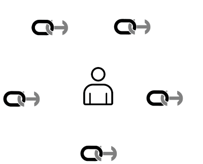
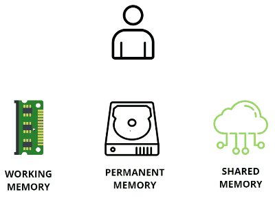

# Data Decentralization

## Opt-In

By default all of a broker's data is stored in broker-local storage and not in decentralized persistence.

A user has to either [opt-in all their data](https://overhide.github.io/overhide/docs/broker.html#operation--auth-opt-in--agree--put) or [select *segment-keys*](https://overhide.github.io/overhide/docs/broker.html#definition-DatastoreKeySettings) to 
leverage decentralized persistence.

Regardless of *opt-in*, the user always has at their disposal [*client-driven* quasi-decentralization](#client-driven-quasi-decentralization) as enabled by the [*client-driven* data migration use-cases](#broker-api-support-for-data-stewardship).

With the exception of the section on [*client-driven* quasi-decentralization](#client-driven-quasi-decentralization) and parts of "[Broker API Support For Data-Stewardship](#broker-api-support-for-data-stewardship)", this write-up discusses [data-stewardship](glossary.md#data-steward) and use of [*IPFS*](https://ipfs.io/) as if the user did *opt-in* into decentralized persistence.

## Data Stewardship

Data decentralization in *overhide* is supported by an explicitly managed network of [data-stewards](glossary.md#data-steward).  

*Data-stewards* are all *overhide* brokers on the same *distributed persistence network* to which a user [authorizes](remuneration-api.md): a subset of all *overhide* brokers on the network.

An *active data-steward* is an [authorized](remuneration-api.md) *overhide* broker that the user interacts with for mutating data.  Only one *overhide* broker can be delegated as an *active data-steward* (see "Data Mutation Speed Considerations" below).

A *passive data-steward* is any other [authorized](remuneration-api.md) *overhide* broker.  There can be many *passive data-stewards*.  These are read-only.  These guarantee to make the user's data available as soon as it's shared with them by the *active data-steward*.  A *passive data-steward* can be made "active" at any time; it's prudent to deactivate any previously *active data-steward*.

All nodes on the broker's *distributed persistence network* may receive and make-available the user's data; but the *stewards* ensure to pin the user's data and guarantee its availability.

## Data Mutation Speed Considerations

Ideally data changes would be immediately finally consistent all across a *distributed persistence network*.  This is not feasible in practice.

User's data mutations go to a specially nominated *active data-steward* before being propagated to other peers.  Each data change progresses through three [persistence-levels](glossary.md#working-memory-permanent-memory-shared-memory-persistence-status):

* [working-memory](glossary.md#working-memory-permanent-memory-shared-memory-persistence-status)
* [permanent-memory](glossary.md#working-memory-permanent-memory-shared-memory-persistence-status)
* [shared-memory](glossary.md#working-memory-permanent-memory-shared-memory-persistence-status)

Each level operates at different update speeds.  Data propagation could be superceded at any level by a faster rate of change upstream.

The [working-memory](glossary.md#working-memory-permanent-memory-shared-memory-persistence-status) and [permanent-memory](glossary.md#working-memory-permanent-memory-shared-memory-persistence-status) are part of the *active data-steward*.  Only changes that progress to [shared-memory](glossary.md#working-memory-permanent-memory-shared-memory-persistence-status) can be pinned by *passive data-stewards* and made available by nodes on the *distributed persistence network*. 

The SHA-256 content-hashes of any [segment-key](glossary.md#segment-key) value can be retrieved for each [persistence-level](glossary.md#working-memory-permanent-memory-shared-memory-persistence-status): use the [GET /{segment-key}/persistence-status](https://overhide.github.io/overhide/docs/broker.html#operation---segment-key--persistence-status-get) API call.  On an active steward equivalence between the [shared-memory](glossary.md#working-memory-permanent-memory-shared-memory-persistence-status) hash and the [working-memory](glossary.md#working-memory-permanent-memory-shared-memory-persistence-status) hash means consistency is achieved.  On a passive steward data is driven by the [shared-memory](glossary.md#working-memory-permanent-memory-shared-memory-persistence-status) value; all hashes would be the same, always.  A client can use this API to validate data propagation, pining, hosting, to passive stewards.

## *Client-Driven* Quasi-Decentralization

A user has ultimate control over their data.  A core-value of *overhide* is that users are always able to extract all of their data from any *overhide* system (provided they know their credentials).  The data may be exported from one *overhide* system and imported into another--presumably with incompatible underlying *distributed persistence network*s.  Users can leverage tooling that uses the [import](https://overhide.github.io/overhide/docs/broker.html#operation-import-WIRE)/[export](https://overhide.github.io/overhide/docs/broker.html#operation-export-WIRE) functionality of *overhide* broker APIs to extract all their data so they can do with it as they please.  That's a contractual obligation on a proper *overhide* broker implementation.

 

The next section introduces a couple *client-driven* data-migration use-cases that dive deeper into this topic in the corresponding [API](https://overhide.github.io/overhide/docs/broker.html#tag-data-stewardship) documentation.

## [Broker API](https://overhide.github.io/overhide/docs/broker.html#tag-data-stewardship) Support For Data-Stewardship

The *data-stewardship* mechanism exists to provide control over where data resides, which necessarily includes ability to move data around.  The *distributed persistence network* and the [*client-driven* quasi-decentralization](#client-driven-quasi-decentralization) are but a transport layer.  Managing data transfers on top of these features--without service interruption--require coordination via several APIs.  The APIs involved are covered in several sample use cases:

1. [Disassociation from Steward Over Persistence Network With Pour-Active Steward](https://overhide.github.io/overhide/docs/broker.html#sample-use-case-disassociation-from-steward-over-persistence-network-with-pour-active-steward)
    * migration of data from one steward to another without interruption
    * typical use-case of migrating *service* or *app* data while allowing user access
    * leverages *distributed persistence network*
    * all migrated data is [opted-in](https://overhide.github.io/overhide/docs/broker.html#operation--auth-opt-in--agree--put)
1. [Client Driven Export+Fill With Pour-Active Steward](https://overhide.github.io/overhide/docs/broker.html#sample-use-case-client-driven-export-fill-with-pour-active-steward)
    * migration of data from one steward to another without interruption
    * similar use-case of migration data while allowing user access to above; except includes all data, even not [opted-in](https://overhide.github.io/overhide/docs/broker.html#operation--auth-opt-in--agree--put)
    * does not involve a *distributed persistence network*
1. [Client Driven Export+Import](https://overhide.github.io/overhide/docs/broker.html#sample-use-case-client-driven-export-import)
    * most basic export and import
    * user access to data is interrupted
    * typical use-case of migrating data by a single user who's fine waiting for the migration to occur  

Refer to the [*data-stewardship* section of the Broker API](https://overhide.github.io/overhide/docs/broker.html#tag-data-stewardship) for an in-depth look at these data-migration use cases as available to *overhide* brokers.

## Overview of [*overhide* Reference Implementation](https://github.com/overhide/overhide-broker) and [*IPFS*](https://ipfs.io/)

The [*overhide* broker reference implementation](https://github.com/overhide/overhide-broker) uses [*IPFS*](https://ipfs.io/) for its decentralized persisted data.

All user data and data-specific metadata is stored on the [*IPFS*](https://ipfs.io/) network.

Broker specific metadata--e.g. configuration and session information--is not stored on the [*IPFS*](https://ipfs.io/) network.

A broker facilitates a connection to [*IPFS*](https://ipfs.io/) and enforces an *overhide* specific data structure on [*IPFS*](https://ipfs.io/).  It enables current *Web 2.0* services to leverage [*IPFS*](https://ipfs.io/) through the *overhide* abstraction.

#### [*Identity*](identity.md) Child Directories

An [*identity*](identity.md) is a token calculated client-side--in *overhide.js*.  To an *overhide* broker an [*identity*](identity.md) certifies a user owns the public key used for broker remuneration.  It is also used to create a directory to contain all the data, metadata, and backchannel queues for [*segment-keys*](glossary.md#segment-key) owned by the user.

Each broker is a steward of its users' data in an instance-local repository (*/repo*).  This repository has a folder for each of the users with their [*identity*](identity.md) as the directory name.  These folders are constantly updated in [*IPFS*](https://ipfs.io/) and [*IPNS*](https://docs.ipfs.io/guides/concepts/ipns/) as users work with their data--this necessarily means that each [*identity*](identity.md) has its own private-public [*IPNS*](https://docs.ipfs.io/guides/concepts/ipns/) key-pair.  The public key constitutes a [*GUID* (globally unique ID)](https://overhide.github.io/overhide/docs/broker.html#/definitions/GUID), which is the user's data content-root on the [*IPNS*](https://docs.ipfs.io/guides/concepts/ipns/) network.  Ideally, on each change of the user's data, the [*IPFS*](https://ipfs.io/) merkle-dag is updated and the [*IPNS*](https://docs.ipfs.io/guides/concepts/ipns/) snapshot is re-referenced.  Realistically the [*IPFS*](https://ipfs.io/) network--and especially the slower [*IPNS*](https://docs.ipfs.io/guides/concepts/ipns/) reference to the most recent data--is only eventually consistent as seen by other brokers.

As each user modifies their data, the broker updates [*IPFS*](https://ipfs.io/), necessarily pins all the content, and re-publishes to [*IPNS*](https://docs.ipfs.io/guides/concepts/ipns/) under the user's [*IPNS*](https://docs.ipfs.io/guides/concepts/ipns/) public-key hash (see [`ipfs name publish`](https://ipfs.io/docs/commands/#ipfs-name-publish))--[the *GUID*](https://overhide.github.io/overhide/docs/broker.html#/definitions/GUID).  The broker makes the user's [*GUID*](https://overhide.github.io/overhide/docs/broker.html#/definitions/GUID) available to the app (service) [via APIs](https://overhide.github.io/overhide/docs/broker.html#operation--guids-get).  Armed with [the *GUID*](https://overhide.github.io/overhide/docs/broker.html#/definitions/GUID) the user can use tooling to directly access their most recent data on [*IPFS*](https://ipfs.io/)--allowing for publishing delay--or [direct their app (service) to use a different broker](https://overhide.github.io/overhide/docs/broker.html#operation--all-data-post) to work with their data.

#### Data as Files

A broker writes data to local files under *//repo/[\<identity>](identity.md)/[\<segment-key>](glossary.md#segment-key)/[\<identity>](identity.md).  All of a user's owned content is under their *//repo/[\<identity>](identity.md)/* subfolder.  The data itself sits in the file named with [identity](identity.md) as file name.  This is to distinguish the owner's data from [delegate data](https://overhide.github.io/overhide/docs/broker.html#tag-delegate).

This data is navigable via [*IPNS*](https://docs.ipfs.io/guides/concepts/ipns/) by dereferencing *\<GUID>/[\<segment-key>](glossary.md#segment-key)/[\<identity>](identity.md)* where *GUID* is the [*identities*](identity.md) [*IPNS*](https://docs.ipfs.io/guides/concepts/ipns/) public-key hash.

The data is encrypted in a [usage specific way](glossary.md#datastore-value-secret).

#### Delegate Data as Files

[Delegate data](https://overhide.github.io/overhide/docs/broker.html#tag-delegate) resides in *//repo/[\<owner-identity>](identity.md)/[\<segment-key>](glossary.md#segment-key)/[\<delegate-identity>](identity.md).  The *owner-identity* subfolder is the [identity](identity.md) of the owner of the referenced [*segment-key*](glossary.md#segment-key).  The *delegate-identity* file contains the [delegate data](https://overhide.github.io/overhide/docs/broker.html#tag-delegate) and is named with the delegate's [identity](identity.md) as file name.

The delegage data is navigable via [*IPNS*](https://docs.ipfs.io/guides/concepts/ipns/) by dereferencing *\<GUID>/[\<segment-key>](glossary.md#segment-key)/[\<delegate-identity>](identity.md)*.

The data is encrypted in a [usage specific way](glossary.md#datastore-value-secret).

#### [Messages](glossary.md#backchannel-queue) as Files

All backchannel queues for an identity are filed under *//repo/[\<identity>](identity.md)/[\<segment-key>](glossary.md#segment-key)/backchannel/[\<identity>](identity.md).  The queue is stored as a file with [identity](identity.md) as the file name.  This is to distinguish the owner's backchannel from [delegate's backchannels](https://overhide.github.io/overhide/docs/broker.html#tag-delegate).

Each queue is navigable via [*IPNS*](https://docs.ipfs.io/guides/concepts/ipns/) by dereferencing *\<GUID>/[\<segment-key>](glossary.md#segment-key)/backchannel/[\<identity>](identity.md)*.

The messages are encrypted in a [usage specific way](glossary.md#datastore-value-secret), decipherable by recipient upon receipt.

#### Delegate [Messages](glossary.md#backchannel-queue) as Files

Delegate's messages are filed under *//repo/[\<owner-identity>](identity.md)/[\<segment-key>](glossary.md#segment-key)/backchannel/[\<delegate-identity>](identity.md).  The *owner-identity* subfolder is the [identity](identity.md) of the owner of the referenced [*segment-key*](glossary.md#segment-key).  The *delegate-identity* file contains the [delegate backchannel queue](https://overhide.github.io/overhide/docs/broker.html#tag-delegate) and is named with the delegate's [identity](identity.md) as file name.

Each queue is navigable via [*IPNS*](https://docs.ipfs.io/guides/concepts/ipns/) by dereferencing *\<GUID>/[\<segment-key>](glossary.md#segment-key)/backchannel/[\<delegate-identity>](identity.md)*.

The messages are encrypted in a [usage specific way](glossary.md#datastore-value-secret), decipherable by recipient upon receipt.

#### Access Metadata as Files

Metadata for a specific [*segment-key*](glossary.md#segment-key) lives under *//repo/[\<identity>](identity.md)/[\<segment-key>](glossary.md#segment-key)/.metadata* file.

Each metadata file is navigable via [*IPNS*](https://docs.ipfs.io/guides/concepts/ipns/) by dereferencing *\<GUID>/[\<segment-key>](glossary.md#segment-key)/.metadata*.

This file is not meant for consumption by the user, but by *overhide* systems; these files are plain-text with pseudonymous content.