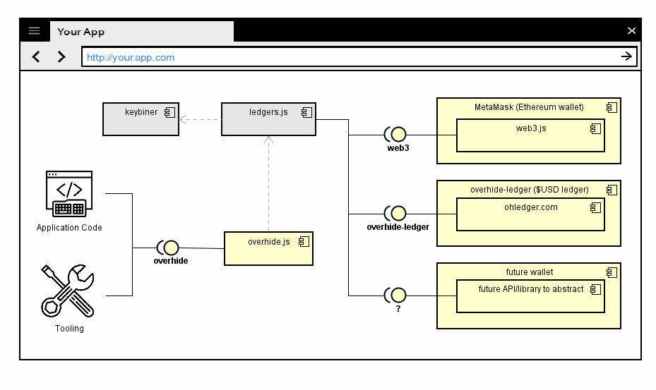

# *overhide.js*

*overhide.js* is the JavaScript client interface to the *overhide* system.  

The intent is that an app developer does not have to couple their app to specific libraries--other than *overhide.js*--to use the *overhide* system.

*Application code* and *tooling* are written against the *overhide* interface.

The *overhide* interface is made concrete by [*overhide.js*](https://github.com/JakubNer/overhide.js)--or other implementations.  [*overhide.js*](https://github.com/JakubNer/overhide.js) is optionally injected by the [*keybiner*](glossary.md#keybiner--keyrings): this isn't strictly necessary, as the *application code* can bring in its own dependency.

Interacting with public ledgers--to the extent that is needed by *overhide* is abstracted by the interface.  For example the *web3*, *shapeshift*, and *?*, interfaces modeled.  The application customer interacts with their [*wallet*](docs/glossary.md#wallet) of choice--if any--which injects necessary bits for *overhide.js* to detect its presence and leverage on behalf of the *application code*.
