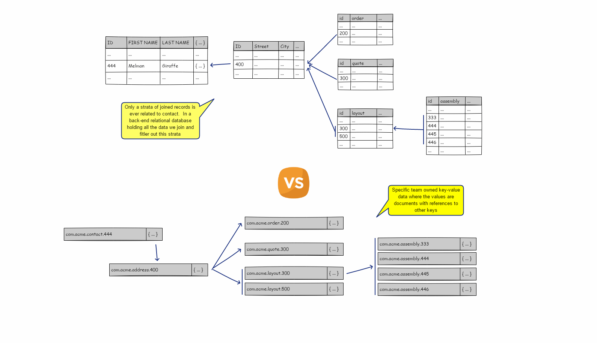
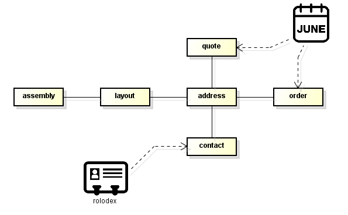
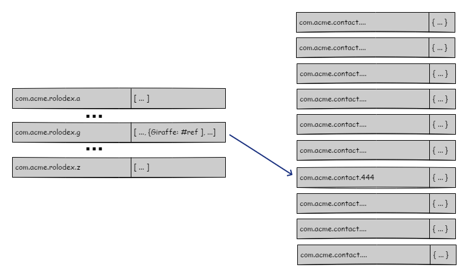
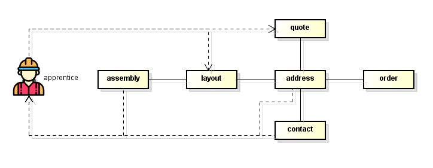

# On Applicability of a Key-Value Store

The *overhide* system is here as an alternative backend for apps and services.  It provides authentication, authorization, and a data store.  But does it apply in many projects?  Can you fit it in your architecture?

This write-up is meant to provoke a way of thinking when writing a meaningful collaborative application without a relational database, with just a key-value store.

Some concepts to consider:

* **state funnel**: state of data is funneled via [backchannels](http://overhide.io/overhide/docs/glossary.html#backchannel-queue) to update [segment-key](http://overhide.io/overhide/docs/glossary.html#segment-key) values in a gated fashion
* **thick client thin client ambivalence**: the datastore is just that, a store of data, all data is processed and mediated client-side: the client thickens as the back-end stays thin
* **relations**: this isn't a relational store, but you can certainly store relations; with *overhide*'s segmentation of data by owner (an individual, a team, a group) relations are references to tightly correlated datastore keys
* **indices**: any data indices are necessairly client-managed value blobs in the datastore with references to particular keys; if a searchable list of strings-to-references is not enough, you could always store of [DB documents](https://github.com/louischatriot/nedb)

## Bring Your Own Data

If you design your system with the expectation of "bring your own data" as a fundamental tenet, you can have a much more manageable data set to enumerate and traverse.

I don't mean "bring it" literally.  The data sits on the network; in [IPFS](https://ipfs.io/), accessed with *overhide*.  I mean figurativelly; the team furnishes their own team-specific data by referencing relevant keys in the datastore.

With such a design there is no need for queries that narrow down a huge data-set to the records your team is interested in: they're all your team's records.  Contrast this with a typical SQL workflow, which starts by selecting a subset of client specific data from a table with millions of unrelated records.

## The Rolodex: Index Files

Even though you're dealing with a data-set cohesive to your team, some queries within this narrower data-set are usually unavoidable.  We still need an ability to query the data dispersed in our key-values.  This cannot be relegated to the *overhide* as a back-end--as *overhide* is completelly uninterested in what your data is and cannot help.  But there is a way:  a judicious use of index files to store metadata references can go a long way to quickly search through your domain.

Consider organizing your metadata into lists of references keyed appropriatelly.  For example all the contacts can be referenced from lists comprizing a rolodex.  All the quotes and orders are perhaps tied to a date, a month.  You might want to organize them in indexes by month.  There is nothing stopping you from having multiple different indexes to each referenced key.

For the rolodex example of index lists to contacts, the key-values might look like the model below.  Notice that each index file is a list of all contacts with a last name starting with a particular letter.

## State Funnel

Consider that the team is comprised of an "owner" and an a bunch of "apprentices".

The owner sets up administrative data, resolves data contentions, has full control of the system.

The apprentices visit customer sites and quote them on layouts.  Apprentices build layouts out of assemblies: assemblies are a combination of parts and labour.  The apprentices submit the quotes for owner's approval.  The owner rubber-stamps quotes converting them to orders.

All these people are using an app on their phones or their browsers to collaborate on a common data-set within our domain model.  Each user's app is a thick client that *funnels* state transitions to keep data *relations* consistent.  The only back-end is the *overhide* system.

The owner owns that team's data-set in *overhide*.  The owner configures the *contacts*, their *address*, and the available *assemblies*.

The apprentices read the *contacts*, drive to the *addresses*, and create layouts from available *assemblies*.  The apprentices furnish *quotes*.  They save off the *layouts* and the *quotes*.  They enqueue *overhide* [backchannel](http://overhide.io/overhide/docs/glossary.html#backchannel-queue) events for the owner to convert the quotes into *orders*.

There are no transactions to lock rows of data or tables.  The domain is organized with a flow of data in mind.

