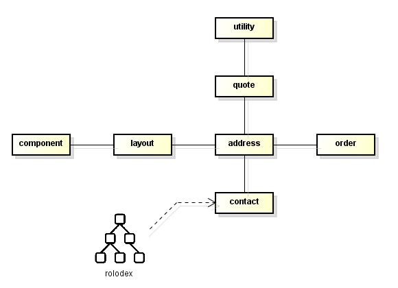

# The State Funnel -- On Thick Client Thin Client Ambivalence and Relations in a Key-Value Store

The *overhide* system is here as an alternative backend for apps and services.  It provides authentication, authorization, and a data store.  But does it apply in many projects?  Can you fit it in your architecture?

This write-up is meant to provoke a way of thinking when writing a meaningful collaborative application without a relational database, with just a key-value store.

It's all in the title:

* **state funnel**: state of data is funneled via [backchannels](http://overhide.io/overhide/docs/glossary.html#backchannel-queue) to update [segment-key](http://overhide.io/overhide/docs/glossary.html#segment-key) values in a gated fashion
* **thick client think client ambivalence**: *overhide* provided data crunching is done--or at least mediated--client-side (instead of a back-end)
* **relations**: this isn't a relational store, but you can certainly store relations; with *overhide*'s segmentation of data by owner--e.g. an individual, a team, a group--consider how references to tightly correlated key-values can be effective over a long constantly filtered tables

The rest of this write-up is an example detailing out flow of data between team-members--each using a mobile app to collaborate on a common data-set.  Each user's app is a thick client that *funnels* state transitions to keep data *relations* consistent.  The only backend is the *overhide* system.

#### Paradigm Shift

If you design your system with the expectation of "bring your own data" as a fundamental tenet, you can have a much more manageable data set to enumerate and traverse.

I don't mean literally.  The data sits in *overhide*.  I mean figurativelly; the team furnishes their own team-specific data by referencing relevant keys in the datastore.

Queries to narrow down your data-set just to the records your team is interested in are not needed.

However queries within your data-set are unavoidable for many applications.  This cannot be relegated to the *overhide* as a back-end--as *overhide* is completelly uninterested in what your data is and cannot help.  A judicious use of key-values to store metadata references can go a long way to quickly search through your domain.

The *rolodex* as a binary-tree of key-values demonstrates this in the example below.

> We have all intentions to bolster the [overhide.js](http://overhide.io/overhide/docs/overhide.js.html) client-side library with helper methods to aid application developers work with references in such binary-tree key-values.  An *overhide* specific client-side reference/query framework if you will.  This sort of boilerplate shouldn't have to be subsidized by the application developer.

#### The Example

Consider an application allowing regional teams to work through sales workflows from quote to final order.  The team brings their own data into the application.  The application is written to work with the following domain model:

Although the application is written with a specific domain model, the data set the team works with is limited to just that team.
